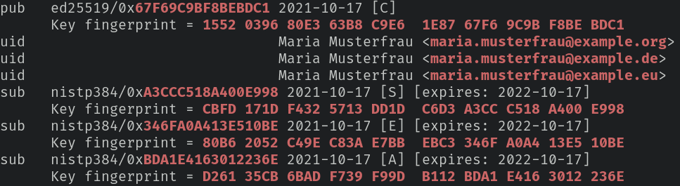

# KISS-like, self-hosted GnuPG keyserver

Following [draft RFC](https://datatracker.ietf.org/doc/html/draft-shaw-openpgp-hkp-00), `hkps2nginx.sh` creates the Nginx configuration for hosting your own GnuPG keyserver which allows only for retrieval of public keys (no sks-like sync, no upload, no index, no vindex).

## System requirements

`hkps2nginx.sh` has been tested on Gentoo Linux and macOS Catalina, both with **GnuPG v2.2.x**. For `hkps2nginx.sh` to function on macOS, you need to install [HomeBrew's](https://brew.sh/) `bash` package:

```bash
brew install bash
```

## Creation of Nginx config

```bash
bash hkps2nginx.sh -h

Execute:
$ bash hkps2nginx.sh -l localPublicKeysFile.asc -r NginxWebroot

Example:
$ gpg --export --armor maria.musterfrau@example.org work@example.org > pubkey.asc
$ bash hkps2nginx.sh -l pubkey.asc -r /var/www/keys/

To indent using tabs:
$ bash hkps2nginx.sh -l pubkey.asc -r /var/www/keys/ | sed 's/    /\t/g' | sed 's/^\([^$]\)/\t\t\1/'
```

Sample `bash hkps2nginx.sh -l pubkey.asc -r /var/www/keys/` output:

```bash
location ~ "^/([A-F0-9]{40})\.asc$" {
    add_header content-disposition "attachment; filename=$1.asc";
    default_type application/pgp-keys;
    root /var/www/keys/;
}

location = /pks/lookup {

    # if query doesn't contain "op=get"
    if ($query_string !~ "^(.+&)*op=get(&.+)*$") {
        return 501;
    }

    # if query doesn't contain "search=..."
    if ($query_string !~ "^(.+&)*search=((0x|)([0-9a-fA-F]{8}|[0-9a-fA-F]{16}|[0-9a-fA-F]{40})|.+@.+)(&.+)*$") {
        return 501;
    }

    # if query contains more than one "op=get"
    if ($query_string ~ "^(.+&)*op=.+&(.+&)*op=.+(&.+)*$") {
        return 501;
    }

    # if query contains more than one "search=..."
    if ($query_string ~ "^(.+&)*search=.+&(.+&)*search=.+(&.+)*$") {
        return 501;
    }

    if ($query_string ~* "^(.+&)*search=((0x|)(1552039680E363B8C9E61E8767F69C9BF8BEBDC1|CBFD171DF4325713DD1DC6D3A3CCC518A400E998|80B62052C49EC83AE7BBEBC3346FA0A413E510BE|D26135CB6BADF739F99DB112BDA1E4163012236E|67F69C9BF8BEBDC1|A3CCC518A400E998|346FA0A413E510BE|BDA1E4163012236E)|maria.musterfrau@example.org|maria.musterfrau@example.de|maria.musterfrau@example.eu)(&.+)*$") {
        return 301 /1552039680E363B8C9E61E8767F69C9BF8BEBDC1.asc;
    }

    if ($query_string ~* "^(.+&)*search=((0x|)(78284C877D61FEDA65FDAB0AECB43B18C6B8E88E|02B63F8A914E81A16DD72A0A24489B037578FBE6|20D29AEC0CF8A7E07AE842BE5D518CAC4D3A9177|653A9BFF0A1A48730B3556AA0E23B2FE2EBC40DE|ECB43B18C6B8E88E|24489B037578FBE6|5D518CAC4D3A9177|0E23B2FE2EBC40DE)|work@example.org)(&.+)*$") {
        return 301 /78284C877D61FEDA65FDAB0AECB43B18C6B8E88E.asc;
    }

    return 404;
}
```

You can visualise the regex in the `if` condition at [Debuggex](https://www.debuggex.com/). Example:


I used `hkps2nginx.sh` to setup my Nginx server for `HKPS`. You can try out my keyserver:

- URL: hkps://keys.duxsco.de
- E-Mail: d at "my github username" dot de
- Key ID in `0xlong`: 0x11BE5F68440E0758

## Verification of public key delivery

You can retrieve a GnuPG public key from `HKPS` using e-mail addresses:

```bash
gpg --auto-key-locate clear,hkps://keys.example.org --locate-external-keys maria.musterfrau@example.org work@example.org
```

... or via hexadecimal identifiers with/without `0x` prefix and, of course, without whitespace:



Beside running above `--locate-external-keys` command for every of your e-mail addresses you should check whether your public key is retrievable with hex identifiers. First, specify the public keys you want to run a check upon and the `HKPS` server you want to retrieve them from. The commands expect you to have the public keys pre-imported.

```bash
IDS="maria.musterfrau@example.org work@example.org"
HKPS="hkps://keys.example.org"
```

Then, copy&paste into your terminal and run:

```bash
gpg --with-colons --list-keys ${IDS} | \
    grep -e "^pub:" -e "^sub:" -e "^fpr:" | \
    cut -d: -f5-10 | \
    sed "s/^\([^:]*\):[^:]\(.*\)/\1/" | \
    tr -d ":" | \
    sed 's/\(.*\)/\1\n0x\1/' | \
    while read I; do
        gpg --quiet --keyserver "${HKPS}" --recv-keys "$I" &&
            echo "$I: ✅" || \
            echo "$I: ❌"
    done
```

## DNS record

You can add the following DNS record for others to better find your keyserver:

```
_hkps._tcp.example.org. 300 IN SRV 1 1 443 keys.example.org.
```

## Other GnuPG repos

https://github.com/duxsco?tab=repositories&q=gpg-
