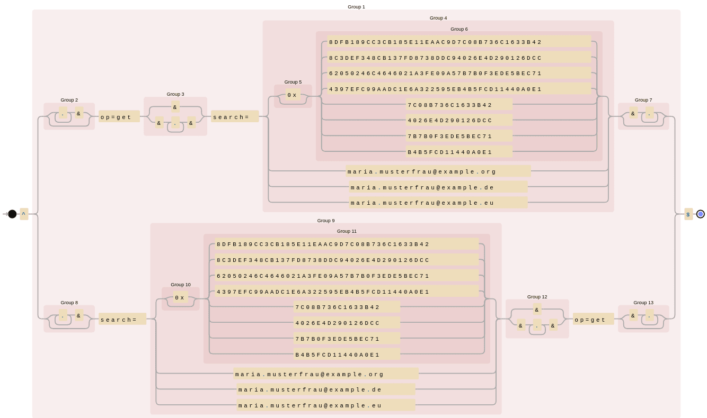
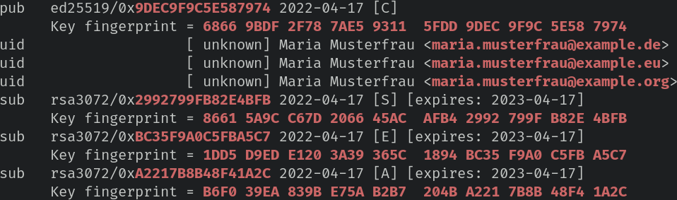
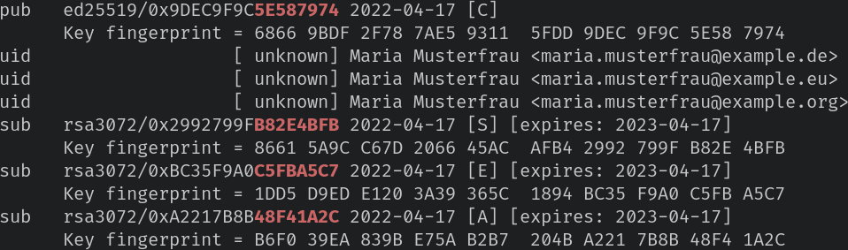

# KISS-like, self-hosted GnuPG keyserver

Following [draft RFC](https://datatracker.ietf.org/doc/html/draft-shaw-openpgp-hkp-00), `hkps2nginx.sh` creates the Nginx configuration for hosting your own GnuPG keyserver which allows only for retrieval of public keys (no sks-like sync, no upload, no index, no vindex).

## System requirements

`hkps2nginx.sh` has been tested on Gentoo Linux and macOS Catalina, both with **GnuPG v2.2.x**. For `hkps2nginx.sh` to function on macOS, you need to install [HomeBrew's](https://brew.sh/) `bash` package:

```bash
brew install bash
```

## Creation of Nginx config

```bash
bash hkps2nginx.sh -h

Execute:
$ bash hkps2nginx.sh -l localPublicKeysFile.asc -r NginxWebroot

Example:
$ gpg --export --armor maria.musterfrau@example.org work@example.org > pubkey.asc
$ bash hkps2nginx.sh -l pubkey.asc -r /var/www/keys/

To indent using tabs:
$ bash hkps2nginx.sh -l pubkey.asc -r /var/www/keys/ | sed 's/    /\t/g' | sed 's/^\([^$]\)/\t\t\1/'
```

Sample `bash hkps2nginx.sh -l pubkey.asc -r /var/www/keys/` output:

```bash
location ~ "^/([A-F0-9]{40})\.asc$" {
    add_header content-disposition "attachment; filename=$1.asc";
    default_type application/pgp-keys;
    root /var/www/keys/;
}

location = /pks/lookup {

    # if query doesn't contain "op=get"
    if ($query_string !~ "^(.+&)*op=get(&.+)*$") {
        return 501;
    }

    # if query doesn't contain "search=..."
    if ($query_string !~ "^(.+&)*search=((0x|)([0-9a-fA-F]{8}|[0-9a-fA-F]{16}|[0-9a-fA-F]{40})|.+@.+)(&.+)*$") {
        return 501;
    }

    # if query contains more than one "op=get"
    if ($query_string ~ "^(.+&)*op=.+&(.+&)*op=.+(&.+)*$") {
        return 501;
    }

    # if query contains more than one "search=..."
    if ($query_string ~ "^(.+&)*search=.+&(.+&)*search=.+(&.+)*$") {
        return 501;
    }

    if ($query_string ~* "^(.+&)*search=((0x|)(68669BDF2F787AE593115FDD9DEC9F9C5E587974|86615A9CC67D206645ACAFB42992799FB82E4BFB|1DD5D9EDE1203A39365C1894BC35F9A0C5FBA5C7|B6F039EA839BE75AB2B7204BA2217B8B48F41A2C|9DEC9F9C5E587974|2992799FB82E4BFB|BC35F9A0C5FBA5C7|A2217B8B48F41A2C|5E587974|B82E4BFB|C5FBA5C7|48F41A2C)|maria.musterfrau@example.de|maria.musterfrau@example.eu|maria.musterfrau@example.org)(&.+)*$") {
        return 301 /68669BDF2F787AE593115FDD9DEC9F9C5E587974.asc;
    }

    if ($query_string ~* "^(.+&)*search=((0x|)(46E6C639E0F6A012AEA11683B8DD0599EDDA35AA|E86700A4C56A138EC54929D6D02E34BE663E6091|3AAF5CDAC88DAFFFF2A069A74D189EE4A6DE96F3|506CD61215D8CCBF7F458A44204443AA16CD9EF4|B8DD0599EDDA35AA|D02E34BE663E6091|4D189EE4A6DE96F3|204443AA16CD9EF4|EDDA35AA|663E6091|A6DE96F3|16CD9EF4)|max.mustermann@example.org)(&.+)*$") {
        return 301 /46E6C639E0F6A012AEA11683B8DD0599EDDA35AA.asc;
    }

    return 404;
}
```

You can visualise the regex in the `if` condition at [Debuggex](https://www.debuggex.com/). Example:



I used `hkps2nginx.sh` to setup my Nginx server for `HKPS`. You can try out my keyserver:

- URL: hkps://keys.duxsco.de
- E-Mail: d at "my github username" dot de
- Key ID in `0xlong`: 0x11BE5F68440E0758

## Verification of public key delivery

You can retrieve a GnuPG public key from `HKPS` using e-mail addresses:

```bash
gpg --auto-key-locate clear,hkps://keys.example.org --locate-external-keys maria.musterfrau@example.org work@example.org
```

... or via hexadecimal identifiers with/without `0x` prefix and, of course, without whitespace:





Beside running above `--locate-external-keys` command for every of your e-mail addresses you should check whether your public key is retrievable with hex identifiers. First, specify the public keys you want to run a check upon and the `HKPS` server you want to retrieve them from. The commands expect you to have the public keys pre-imported.

```bash
IDS="maria.musterfrau@example.org work@example.org"
HKPS="hkps://keys.example.org"
```

Then, copy&paste into your terminal and run:

```bash
COLONS_OUTPUT="$(gpg --with-colons --list-keys ${IDS})"
(
    grep "^fpr:" <<<"${COLONS_OUTPUT}" | cut -d: -f10
    grep "^fpr:" <<<"${COLONS_OUTPUT}" | cut -d: -f10 | grep -Eo "^.{50}"
    grep -e "^pub:" -e "^sub:" <<<"${COLONS_OUTPUT}" | cut -d: -f5
    grep -e "^pub:" -e "^sub:" <<<"${COLONS_OUTPUT}" | cut -d: -f5 | grep -Eo ".{8}$"
) | \
while read -r I; do
    gpg --quiet --keyserver "${HKPS}" --recv-keys "$I" &&
        echo "$I: ✅" || \
        echo "$I: ❌"
done
```

## Publication of GnuPG keyserver

You can add the following DNS record for others to better find your keyserver:

```
$ delv +nodnssec SRV _hkps._tcp.example.org
; fully validated
_hkps._tcp.example.org. 300 IN SRV 1 1 443 keys.example.org.
```

Furthermore, you can add [sig-keyserver-url](https://github.com/duxsco/gpg-config-and-scripts/search?q=sig-keyserver-url) to your `~/.gnupg/gpg.conf`.

## Other GnuPG repos

https://github.com/duxsco?tab=repositories&q=gpg-
